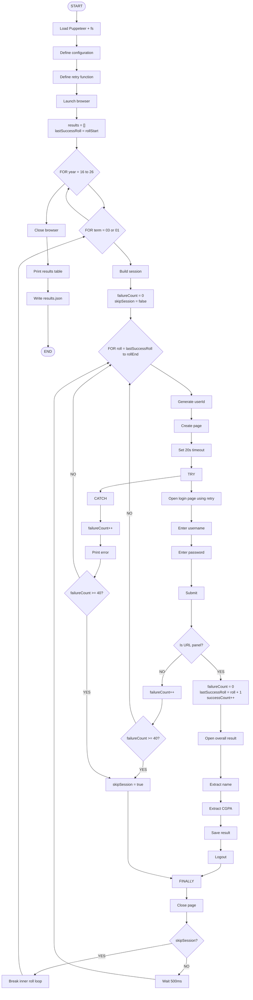

## nubtk-cgpa-fetch

This project appears is an automated program to find Northern University of Business and Technology (NUBTK) students information like name and grade point average (CGPA) from the official website by using default password.

## How It Works

1. Program Goes to "https://nubtkhulna.ac.bd/ter"

2. Input A pre programed user name & password and press button to login to students personal page
https://nubtkhulna.ac.bd/ter/panel/overallresult

3. Navigate to Find Name & CGPA with HTML tag & xPath and fetch data and stores in json file
https://nubtkhulna.ac.bd/ter/panel/overallresult

## AI won't build anything illegal
## But human will

## Project Structure

| File              | Description                                                      |
|-------------------|------------------------------------------------------------------|
| `checkUsers.js`   | Check users one at a time `main program`                         |
| `checkCourse.js`  | Extract all data `extended version of checkUsers.js`             |
| `dna.js`          | Academic dna data visualisation                                  |
| `dna.py`          | Simple academic analysis                                         |
| `dna.csv`         | Dna analysis clustering                                          |
| `clean.js`        | Clean all students course data                                   |
| `clean.csv`       | Combined cleaned data                                            |
|-------------------|------------------------------------------------------------------|
| `arch.json`       | Architecture department                                          |
| `bba.json`        | Business Administration department                               |
| `ce.json`         | Civil Engineering department                                     |
| `cse.json`        | Computer Science & Engineering department                        |
| `eee.json`        | Electrical and Electronic Engineering department                 |
| `ell.json`        | English Language & Literature department                         |
| `jmc.json`        | Journalism and Mass Communication department                     |
|-------------------|------------------------------------------------------------------|
| `arch25.json`     | Architecture department upto fall 2025                           |
| `bba25.json`      | Business Administration department upto fall 2025                |
| `ce25.json`       | Civil Engineering department upto fall 2025                      |
| `cse25.json`      | Computer Science & Engineering department upto fall 2025         |
| `eee25.json`      | Electrical and Electronic Engineering department upto fall 2025  |
| `ell25.json`      | English Language & Literature department upto fall 2025          |
| `jmc25.json`      | Journalism and Mass Communication department upto fall 2025      |
|-------------------|------------------------------------------------------------------|
| `archC.json`      | Architecture department with Courses                             |
| `bbaC.json`       | Business Administration department with Courses                  |
| `ceC.json`        | Civil Engineering department with Courses                        |
| `cseC.json`       | Computer Science & Engineering department with Courses           |
| `eeeC.json`       | Electrical and Electronic Engineering department with Courses    |
| `ellC.json`       | English Language & Literature department with Courses            |
| `jmcC.json`       | Journalism and Mass Communication department with Courses        |
|-------------------|------------------------------------------------------------------|
  

- `npm.json`, `package.json`: Node.js project configuration and dependencies.

## CheckUsers.js Algorithm



### Later version
`checkCourse.js`

extended version of checkuser.js which scraps all course data including serial number, course code, course title, creadit hour, grade, cgpa all together

### Configuration

Open the script and review the constants at the top:

- **baseUrl** — Root URL of the authorized environment (e.g., your staging clone or local mock).
- **department** — Department code used in constructing IDs.
- **rollStart, rollEnd** — Inclusive roll number range to try.
- **failCheck** — Maximum consecutive login failures before skipping to next session.
- **Year/term loops** — Adjust the ranges/sets to match the sessions you’re auditing.
- **Throttle** — The `setTimeout(500)` between attempts; raise this to reduce load.

### How It Works (Process)

---
1. Launch headless Chromium.
---
2. For each configured session (year × term):
    - Iterate roll numbers in the specified range.
    - Construct a candidate user ID (same value used as password in this script).
    - Open login page, submit credentials, and wait for navigation.
    - **On success:**
        - Visit the results page and extract allowed fields (e.g., name, CGPA).
        - Append a record to memory.
        - Log out, then continue.
    - **On failure or error:**
        - Increment consecutive failure counter.
        - If it reaches `failCheck`, skip the rest of this session (early exit).
    - Close the page and wait briefly (throttle).
---
3. After all sessions:
    - Close the browser.
    - Print a summary table to console.
    - Write `results.json` with collected records.
---

## Getting Started
1. **Install dependencies**:

    Install Puppeteer and dependencies for parallel processing:
    ```powershell
    npm install puppeteer
    npm install p-map
    ```

    Or, to install all dependencies at once (if listed in `package.json`):
    ```powershell
    npm install
    ```

2. **Run scripts**:

    You can run any of the JavaScript files using Node.js. For example:
    ```powershell
    node checkDept.js
    ```

## Purpose
Data scraping for analysis and visiulization of students academic performance. 

## Contributing
Feel free to open issues or submit pull requests for improvements or bug fixes.

